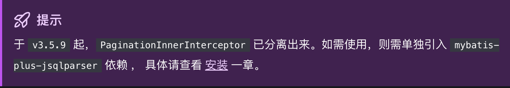

# 初识Mybatisplus

**达达法则：学习一门技术，要学会怎么用、什么时候用、为什么用**

- 什么时候用 ==> 关注的是 **“在什么项目场景下选择它”**
- 为什么用 ==> 关注的是 **“它有什么优点”**，为什么值得在这个项目中使用。


**什么是Mybatisplus?**

**Mybatis-Plus** --- MyBatis 最佳搭档，只做增强不做改变，为简化开发、提高效率而生。

这句话是[Mybatisplus](https://baomidou.com/)官网首页的第一句话，意思就是：Mybatisplus是一个Mybatis的增强工具，在 MyBatis 的基础上**只做增强不做改变**，为**简化开发、提高效率**而生。


**1. 学会怎么用Mybatisplus**

- 初学者一般都是建议先看教学视频的
  - 因为我认为初学者是比较难把握一门技术的重点内容的，如果都是直接看官方文档进行学习，就意味着可能要一次性把所有内容都看完，有时候这会付出更多的时间成本。而直接看教学视频，往往博主都是做好了备课的，博主知道哪些常用，哪些必须要用，还有学完之后往往都会直接上实战，有助于掌握新学的知识点。
- 有经验的一般都是看官网文档来**辅助学习**的


**2. 什么时候用Mybatisplus**

- 想快速开发 CRUD，而不想手写 XML。
  - MP 的核心优势就是：只需继承 BaseMapper（IService），就有了：insert、selectById、updateById、deleteById...

- 已经在用 MyBatis，但嫌它繁琐，可以更换为Mybatisplus
  - MyBatis 的 `mapper.xml` 维护起来复杂且容易出错，MP 把这些繁琐操作封装成简洁方法，让开发更快。

- 项目的数据库结构清晰，业务逻辑不太复杂
  - 比如做后台管理系统、CMS、BBS、博客等场景，MP 非常适用。

- 希望有更强的分页、条件构造器功能
  - MyBatis 本身没有分页能力，MP 提供了 `Page<T>` 和 `QueryWrapper`、`LambdaQueryWrapper` 这些功能，开发体验很好。

**补充：什么时候不建议使用Mybatisplus**

-  SQL 特别复杂，需要多表关联、大量自定义语句。这种时候可能就需要需要手写 SQL，MP 反而可能“帮倒忙”。
- 在做高性能的数据库优化，对 SQL 细节有严格控制需求。MP 的抽象层可能不够“完美”，不如手写 SQL 来得精准。


**3. 为什么用Mybatisplus**

使用 **MyBatis-Plus（MP）** 的主要原因是它大大**简化了 MyBatis 的使用成本和开发效率**，同时保留了 MyBatis 的灵活性。

- 一句话总结就是：

> MyBatis-Plus = 更少的代码 + 更快的开发 + 更强的功能

- 内置通用 CRUD，少写代码
- 支持链式条件构造器（QueryWrapper / LambdaQueryWrapper）。不用再拼接 SQL 字符串，用对象构建查询更清晰。

```java
QueryWrapper<User> wrapper = new QueryWrapper<>();
wrapper.eq("age", 18).like("name", "小");
```

- 自带代码生成器：一键生成 Entity、Mapper、Service、Controller，不用自己写重复代码。

> 可以在idea插件市场里安装插件：MybatisX，可以很快的生成entity、mapper等

- 性能优化、插件机制丰富

> 支持乐观锁、逻辑删除、SQL 性能分析、自动填充字段等插件。
>
> 插件配置灵活，增强了扩展性。

- 兼容 MyBatis，迁移成本低

> 可以在已有 MyBatis 项目里逐步引入 MP，而不是全盘替换。


**补充：分页插件需要单独引入新的依赖问题**

MyBatis-Plus 的分页插件 `PaginationInnerInterceptor` 提供了强大的分页功能，支持多种数据库，使得分页查询变得简单高效。



```xml
<dependency>
    <groupId>com.baomidou</groupId>
    <artifactId>mybatis-plus-jsqlparser</artifactId>
  	<version>3.5.9+</version> <!-- 具体版本要和Mybatisplus版本一致 -->
</dependency>
```


**分页插件知识点**

- 在Spring boot项目中添加分页插件配置类

```java
@Configuration
public class MybatisPlusConfig {

    @Bean
    public MybatisPlusInterceptor mybatisPlusInterceptor() {
        MybatisPlusInterceptor interceptor = new MybatisPlusInterceptor();
        // 添加分页插件，支持 MySQL
        // PaginationInnerInterceptor需要单独引入依赖	
        interceptor.addInnerInterceptor(new PaginationInnerInterceptor(DbType.MYSQL));
        return interceptor;
    }
}
```

- 使用分页插件

假设有一个 `User` 实体和 `UserMapper`：

```java 
@Data
public class User {
    private Long id;
    private String name;
    private Integer age;
}
```

```java
public interface UserMapper extends BaseMapper<User> {
}
```

- 编写分页查询逻辑

```java
@Autowired
private UserMapper userMapper;

public void testPage() {
    // 参数1：当前页码，参数2：每页记录数
    Page<User> page = new Page<>(1, 5);

    // 条件构造器（这里不加条件）
    QueryWrapper<User> wrapper = new QueryWrapper<>();

    // 执行分页查询
    Page<User> resultPage = userMapper.selectPage(page, wrapper);

    // 打印分页结果
    System.out.println("总页数：" + resultPage.getPages());
    System.out.println("总记录数：" + resultPage.getTotal());
    resultPage.getRecords().forEach(System.out::println);
}
```

- 分页插件是如何起作用的？

> 配置类负责开启分页功能，分页查询代码负责发起分页查询请求，二者通过 MyBatis-Plus 的底层机制关联起来。

添加分页插件配置类的那部分代码的作用：**告诉 MyBatis-Plus 在执行 SQL 前要先经过这个插件**。

- 插件会在 `selectPage(...)` 等方法执行前拦截 SQL。
- 然后自动给 SQL 加上 `LIMIT` 和 `OFFSET` 来实现分页查询。
- 如果**不写这个配置类**，那即使写了 `selectPage(...)`，最终生成的 SQL 是 **不带 LIMIT 的**，也就**没有分页效果**了。


第二部分：业务代码中分页查询，这个部分的作用：

- 通过 `Page` 对象告诉 MyBatis-Plus：“我要查第几页，每页多少条”
