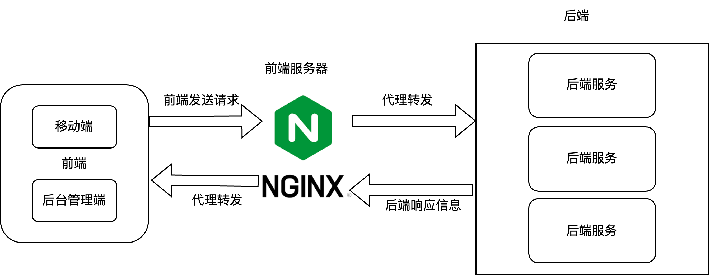
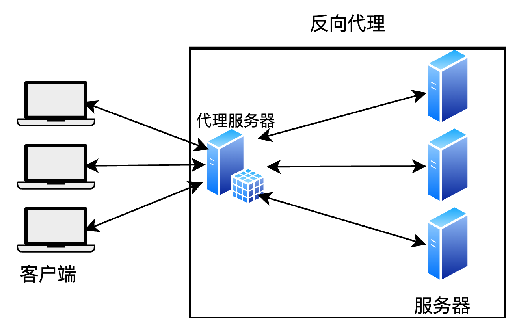

# 初识Nginx

**nginx ("*engine x*") is an HTTP web server, reverse proxy, content cache, load balancer, TCP/UDP proxy server, and mail proxy server.**

**这是Nginx官网的第一句话，译为：nginx("engine x")是HTTP Web服务器、反向代理、消息缓存、负载均衡器、TCP/UDP代理服务器和邮件代理服务器。**

Nginx的功能有很多，那么它在一个前后端分离的项目中**扮演的角色**是什么呢？

**项目场景：**

- 前端向后端发送请求，如请求静态资源、查询数据等请求，因为项目中部署了Nginx，那么前端的请求就会统一发送给Nginx，然后由Nginx统一代理转发这些请求给后端服务。
- 具体Nginx是怎么转发的？怎么选择转发给哪个后端服务对象的 ？有待补充。
- 后端服务接收到Nginx代理转发的请求后，进行一系列业务处理后，将响应信息统一发送给Nginx，再由Nginx代理转发给前端。
- 所以在这个过程中，Nginx实际上是一个中间人，一个联系前后端的中间人，前后端之间的所有交流都由Nginx来代替转发。

**学习一门技术的三大核心要点：就是要学会怎么用、什么时候用、为什么用**

**什么时候需要用到Nginx呢？**

- 反向代理
- 负载均衡
- 消息缓存，高并发场景的缓存优化
- 带宽控制
- 跨域问题处理
- 高性能、处理高并发、低内存占用
- 将 Web 服务器推到基础架构的边缘，并以不同的方式在其周围集成相同或改进的应用程序和数据库工具。

**那么为什么需要用Nginx呢？**

- 之所以需要用 Nginx，是因为它能让网站运行更快、更安全、更稳定，而且能处理更多访问用户。
- Nginx的反向代理功能：相当于Nginx是访问后端服务器统一且唯一的入口。如果没有Nginx作为统一的入口，那前端访问后端服务器时就是直接访问**后端服务器IP+端口**，这种直接暴露服务器IP+端口是非常不安全的。“坏人”会直接对后端服务器进行攻击等。所以使用Nginx，那暴露的只有Nginx的IP+端口，这是安全可靠的，并且是可控的、必要的暴露。
- 提供前端页面（静态资源服务）：前端打包后的 HTML/CSS/JS 文件可以交给 Nginx 来处理，它专门为这个优化过，比后端代码跑静态文件快很多。
- 负载均衡：一个项目跑在一个服务器上，处理不了太多用户。如果启动多个后端服务，Nginx 就能帮忙“分流”。即： 自动把用户请求分发到多个服务实例，避免单点故障。
- 缓存和压缩：Nginx 可以缓存一些接口数据或静态资源，甚至自动压缩响应内容，提高访问速度，降低服务器负载。
- Nginx跨平台，配置简单。
- 内存消耗小

**正向代理和反向代理**

正向代理（Forward Proxy）和反向代理（Reverse Proxy）是网络中的两种代理方式，它们的作用和使用场景不同。下面是它们的**区别**：

1. **代理的对象不同：**

- **正向代理**：客户端的代理，代表客户端向服务器请求资源。
   ➤ **客户端知道目标服务器**，但服务器不知道真实客户端是谁。
- **反向代理**：服务器的代理，代表服务器响应客户端请求。
   ➤ **客户端不知道真正的服务器**是谁，代理服务器代替它响应。

2. **使用场景不同：**

- **正向代理**：
  - 科学上网（访问被限制的网站）
  - 内网客户端访问外网
  - 提高访问隐私
  - 缓存网页加速访问
- **反向代理**：
  - 网站负载均衡（如 Nginx）
  - 安全防护（隐藏真实服务器）
  - 统一入口管理
  - 静态/动态内容分发

3. **工作位置不同：**

- **正向代理**：
  - 部署在客户端一侧（用户网络内部）
  - 客户端配置代理服务器地址
- **反向代理**：
  - 部署在服务器端一侧（网站前端）
  - 客户端不需要任何配置

**正向代理图**

**反向代理图**

**nginx was written with a different architecture in mind—one which is much more suitable for nonlinear scalability in both the number of simultaneous connections and requests per second.**

**这段话译为：Nginx 是基于一种不同的架构理念设计的。这种架构在同时连接数和每秒请求数的非线性可扩展性方面更为合适。**

这句话是在说 Nginx 相对于传统 Web 服务器（比如 Apache）来说，在架构设计上采取了一种**不同的方式**，这使得它在处理**高并发请求**时表现得更好，尤其是在：

- **同时连接数很多（高并发连接）**
- **每秒请求数很高（高吞吐量）**

情况下，**扩展性更强，性能更稳定**。

**“不同的架构”是指什么？**

Nginx 使用的是：

> **事件驱动 + 异步非阻塞 + 单线程多连接（epoll）模型**

与此对比，传统的 Apache 使用的是：

> **多进程或多线程模型**

**对比示例**

| 特性     | Apache（传统）        | Nginx（现代）              |
| -------- | --------------------- | -------------------------- |
| 模型     | 每个请求一个线程/进程 | 单线程处理成千上万请求     |
| 资源占用 | 高（线程多，占内存）  | 低（少量线程，高效率）     |
| 并发能力 | 差，性能下降快        | 优，性能随连接数增长仍稳定 |
| 扩展性   | 非线性，可扩展性差    | 非线性扩展性好             |
| 吞吐量   | 易受限                | 更高的并发吞吐             |

**什么是“线性可扩展性？”**

- 在传统架构下，**每增加一个连接就增加一个线程/进程**，资源消耗和性能压力成**线性甚至指数上升**，很快系统就“顶不住”。

- Nginx 则不同，它使用的是**异步事件驱动**模型，即使有**几万个并发连接**，也能用**少量线程**处理，资源消耗增长非常缓慢，**扩展性非线性，更适合大规模并发访问**。
