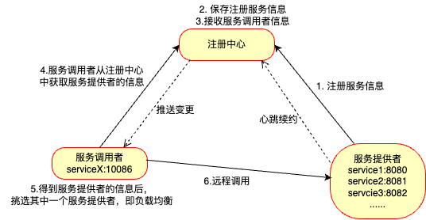

# 微服务中的注册中心

## 一、远程调用中存在的问题

我们知道，远程调用是需要提供`url`的，在`url`中需要指定`ip`地址、端口号、资源路径等内容。如果只是在一个单体架构的项目中，那么这个项目只部署在一个服务器上，那么写死`url`是没有问题的，但是在微服务架构的项目中，不同的微服务一般都是部署在不同的服务器上，甚至有时候为了缓解一个微服务的并发压力，还需要将这个微服务拆分为多份，部署在更多的服务器上，即将一个微服务拆分成多个**实例**。

这时候进行远程调用的时候又如何知道这些不同的微服务、不同的实例的`ip`地址？又如何知道这些实例占用的是哪个端口号？如果依旧是写死的`url`，那么能使用的微服务都是确定的，但是为了缓解微服务的压力而拆分为多个实例后，只能使用写死的其中一个实例，那就达不到缓解压力的效果，这就白拆分了。而且，如果扩展了新的微服务到项目中，其它已经写好的微服务又如何感知到这个新的微服务的存在？难道去改原有的代码吗？这不可能的，违背了OCP原则。这就是远程调用中存在的主要问题，所以该怎么解决呢？

```java
@Service
public class OrderService {

    @Autowired // 注入OrderMapper
    private OrderMapper orderMapper;

    @Autowired // 注入RestTemplate
    private RestTemplate restTemplate;

    public Order queryOrderById(Long orderId) {
        // 1.查询订单
        Order order = orderMapper.findById(orderId);
        // 2. 利用RestTemplate发起http请求，查询用户
        // 2.1 url路径，因为在Order对象中包含了userId，所以url需要拼接字符串
        String url = "http://localhost:8081/user/" + order.getUserId();
        // 2.2 发送http请求，实现远程调用
        User user = restTemplate.getForObject(url, User.class);
        // 封装user到Order对象中
        order.setUser(user);
        // 4.返回
        return order;
    }
}
```


## 二、注册中心

为了解决上述远程调用存在的问题，那就需要进行**服务治理**，服务治理就需要引入**注册中心**。

- 在引入注册中心后，所有微服务及其拆分后得到的所有实例都**需要在注册中心中注册服务信息**（这样，不论之后新增多少微服务和实例，服务调用者都能够准确的从注册中心中获取信息）。
- 注册中心将服务提供者的信息保存起来后，等待服务调用者的调用服务信息。当服务调用者向注册中心发送需求后，注册中心根据需求将**所有符合条件的服务提供者**的信息发送给服务调用者。
- 服务调用者获取到服务提供者的信息后，开始挑选服务提供者，这就到了**负载均衡发挥作用**的时候了（负载均衡会根据设置好的算法，如：轮询、加权轮询、随机、源地址哈希等来进行服务提供者的选择）。
- 服务调用者选好服务提供者之后，就开始进行**远程调用，享受服务。**

思考新的问题：**如何确定服务提供者是否还在正常运行？**

- 这就是**心跳续约**的工作了，心跳续约：一般每30s，服务提供者会向注册中心发送“我还活着”的信息。
- 注册中心如果接收到的心跳续约的信息里，有服务提供者挂掉了，就会向服务调用者发送变更信息，即**推送变更**。

举个简单的例子：家长想给自己的孩子找一个数学家教老师，这就会联系家政中心，询问有没有符合条件的老师。而家政中心在这个家长询问之前，就已经保存有很多来投递简历的“老师”和“高人”了，然后家政中心会根据这个家长的需求，找出符合条件的数学老师，并将资料发送给家长，由家长进行挑选。家长挑选完毕后，就通过电话等联系方式来联系数学老师......。在这里吗家长就是服务调用者，家政中心就是注册中心，所有投递简历并被家政中心接收的人就是服务提供者。同时，家长不需要关心数学老师有多少人，只需要告诉jiazheng 中心他需要数学老师即可。相应的，服务调用者不需要关心服务提供者有多少，只需要告诉注册中心自己需要什么服务即可。





**小结**

- 服务治理中的三个角色
  - 注册中心：记录并监控微服务各实例状态，推送服务变更信息等
  - 服务提供者：暴露服务接口，供其他服务调用
  - 服务消费者：调用其它服务提供的接口
- 服务消费者如何获取服务提供者的信息？
  - 服务提供者在启动时注册自己的信息到注册中心，服务消费者可以从注册中心订阅和拉取服务信息。
- 服务消费者如何得知服务状态变更？
  - 服务提供者通过**心跳续约**机制向注册中心报告自己的健康状态，当心跳异常时注册中心会将异常服务剔除，并通知订阅了该服务的服务消费者。
- 当服务提供者有多个实例时，服务消费者选择哪一个？
  - 服务消费者可以通过负载均衡算法从多个实例中进行挑选。


## 三、Nacos注册中心

注册中心组件有很多，[Nacos](https://nacos.io/)是目前国内企业中占比最高的注册中心组件。它是阿里巴巴的产品，目前已加入SpringCloudAlibaba中。

具体Nacos的部署这里并不解释。
