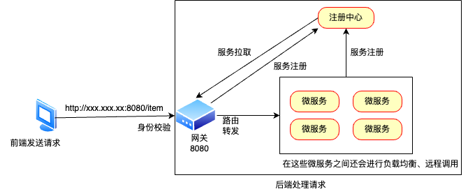

# 微服务中的网关

## 一、网关

**网关：**就是网络的关口，负责请求的路由、转发、身份校验。

场景：现在前端要发送一个HTTP请求到后端来访问某个界面（登录界面、支付界面、订单界面等），在平常我们只是用鼠标点击，然后等待跳转界面即可。但是实际情况是：前端需要得到该界面等`IP`地址信息，端口信息等内容，但是这些信息是不会从后端暴露出来的，相当于对于前端来说，这个后端都是个**黑盒**的状态，那么前端该怎么获取这些信息并跳转到合适的地方呢？

这就需要**网关**来和前端进行交互了。网关相当于整个后端项目的关口，前端发送请求后，由网关统一处理。所以前端只需要知道网关的信息即可。

- 网关首先会进行身份校验，判断身份是否合法。身份合法后，网关根据前端发送过来的请求信息，找到相应的微服务及其详细信息，并告诉前端，这就是**路由**。
- 而后网关还会将该请求信息带到相应的微服务中，这就是**转发**。

举个简单的例子：王五来到一个小区想找亲戚，到了门卫那，和门卫大爷说明情况。大爷要求王五提供身份证明并验查身份后（身份校验），帮王五查找到了他的亲戚住在哪栋楼哪层门牌号等详细信息并告诉了王五（路由），然后大爷还是个好心人，主动带王五去到他亲戚住的地方（转发）。大概就是这个流程。

> 网关也是服务提供者和服务调用者，所以需要向注册中心进行服务注册。

**网关的实现**

- **Spring Cloud Gateway**（主要使用）：Spring官方出品，基于**WebFlux响应式编程**，无需调优即可获得优异性能。

- **Netfilx Zuul**（很少使用）：Netflix出品，基于**Servlet的阻塞式编程**，需要调优才能获得与SpringCloudGateway类似的性能。

